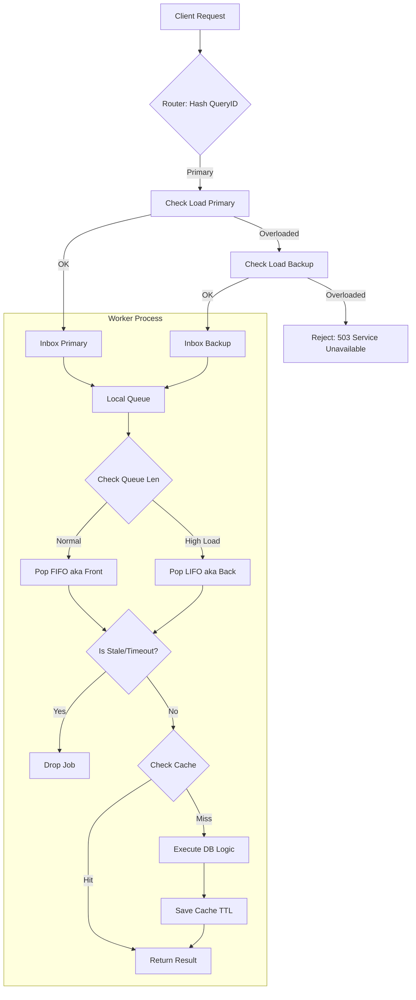

# Laminar Adaptive Compute Architecture
## High-Performance Sharded Worker System

### 1. Giới thiệu (Overview)

Hệ thống **Laminar Compute Server** được thiết kế để xử lý lượng request cực lớn (High Concurrency) với độ trễ thấp nhất. Kiến trúc này không sử dụng mô hình "Global Queue" truyền thống mà áp dụng mô hình **Sharded Worker Pool** kết hợp với **Adaptive Queueing Strategy** (Chiến lược hàng đợi thích ứng).

Mục tiêu cốt lõi:
1.  **Tối đa hóa Cache Hit:** Đảm bảo request của cùng một User/Tenant luôn được xử lý bởi cùng một Worker.
2.  **Chống sập hệ thống (Resilience):** Tự động bảo vệ trước các đợt tấn công hoặc traffic đột biến (Spike).
3.  **Hồi phục nhanh (Quick Recovery):** Ưu tiên phục vụ request mới khi quá tải, thay vì cố gắng xử lý backlog đã chết.

---

### 2. Kiến trúc Định tuyến (Smart Routing)

Hệ thống sử dụng kỹ thuật **Bounded-Load Consistent Hashing** để định tuyến request tới các Worker.

#### Cơ chế hoạt động:
1.  **Primary Assignment (Consistent Hashing):**
    *   Mỗi Request được hash dựa trên `QueryID` (hoặc TenantID).
    *   Hệ thống tính toán ra **Primary Worker** chịu trách nhiệm.
    *   *Mục đích:* Tận dụng **Data Locality** (Cache cục bộ trong RAM worker).

2.  **Load Check (Kiểm tra tải):**
    *   Trước khi gửi Job, hệ thống kiểm tra tải hiện tại của Primary Worker.
    *   Nếu `CurrentLoad < Threshold`: Gửi vào Primary (Giữ Cache Hit).

3.  **Spillover / Fallback (Tràn tải):**
    *   Nếu Primary quá tải (`> Threshold`), hệ thống chọn một **Backup Worker** (thường là worker kế tiếp trong vòng tròn hash).
    *   Nếu Backup rảnh hơn Primary: Chuyển hướng Reuqest sang Backup.
    *   *Trade-off:* Chấp nhận mất Cache Hit để cứu hệ thống không bị nghẽn cục bộ (Hotspot Prevention).

4.  **Backpressure (Phản áp):**
    *   Nếu cả Primary và Backup đều đầy: Từ chối request ngay lập tức (`Server Overloaded`).

---

### 3. Chiến lược Hàng đợi Thích ứng (Adaptive Queueing Strategy)

Đây là "bộ não" của từng Worker, cho phép worker tự động thay đổi hành vi dựa trên áp lực công việc.

#### Trạng thái Bình thường: FIFO (First-In-First-Out)
*   **Điều kiện:** Độ dài hàng đợi < **40** (Low Water Mark).
*   **Hành vi:** Xử lý tuần tự. Ai đến trước phục vụ trước.
*   **Ý nghĩa:** Đảm bảo **Sự công bằng (Fairness)** cao nhất cho mọi người dùng.

#### Trạng thái Quá tải: LIFO (Last-In-First-Out)
*   **Điều kiện:** Độ dài hàng đợi > **80** (High Water Mark).
*   **Hành vi:** Worker chuyển sang chế độ "Cấp cứu".
    *   Lấy job **MỚI NHẤT** (ở cuối hàng đợi) ra xử lý trước.
    *   Job cũ ở đáy hàng đợi sẽ bị đẩy lùi lại.
*   **Ý nghĩa:** Tối ưu hóa **Sự tươi mới (Freshness)**.
    *   Trong cơn bão request, những request cũ thường đã bị Client timeout (hủy đợi). Nếu xử lý chúng là lãng phí tài nguyên.
    *   Xử lý request mới nhất giúp tăng tỉ lệ phản hồi thành công (Goodput).

#### Hysteresis (Cơ chế trễ)
*   Để tránh hệ thống bật/tắt chế độ liên tục (Flapping), hệ thống sử dụng khoảng đệm giữa mức 40 và 80.

---

### 4. Cơ chế Tự phục hồi (Self-Healing)

Worker không chỉ xử lý, mà còn biết "lọc rác" chủ động.

1.  **Stale Job Dropping (Bỏ job thiu):**
    *   Mỗi Job khi vào hàng đợi được đóng dấu thời gian `EnqueuedAt`.
    *   Khi lấy ra xử lý, nếu `Time.Now() - EnqueuedAt > MaxQueueAge` (ví dụ 3s) -> **DROP NGAY LẬP TỨC**.
    *   *Lý do:* Request đã quá cũ, Client chắc chắn đã timeout. Xử lý là vô nghĩa.

2.  **Context Cancellation:**
    *   Nếu Client ngắt kết nối (`ctx.Done()`) trong lúc Job đang chờ -> Drop job.

---

### 5. Hệ thống Caching (Ristretto)

Sử dụng thư viện **Ristretto** (High performance, lock-free) thay vì Global Cache (Redis) để đạt độ trễ micro-seconds.

*   **Vị trí:** Local In-Memory Cache tại mỗi Worker.
*   **Chiến thuật:** Cache-Aside.
    1.  Check Cache -> Hit -> Return.
    2.  Miss -> Execute DB/Logic -> Set Cache (với TTL).
*   **TTL (Time-To-Live):** Mọi Query đều có hạn sử dụng (ví dụ 5s - 60s) để đảm bảo tính đúng đắn dữ liệu (Eventual Consistency) và tự động giải phóng RAM.

---

### 6. Luồng đi của một Request (Request Lifecycle)

### 7. Hiệu năng quan sát (Benchmark Performance)

Dựa trên kết quả Load Test nội bộ (Môi trường Dev):

| Scenario | Mô tả | RPS (Reqs/sec) | Latency Avg | Ghi chú |
| :--- | :--- | :--- | :--- | :--- |
| **Hot Cache** | 100% Cache Hit | **~800,000** | ~60µs | Tận dụng tối đa Ristretto & CPU |
| **Distributed** | 100% Cache Miss (DB IO) | **~340,000** | ~100µs | Sharding chia tải tốt cho DB |
| **Overload** | Spam request quá tải | **~320,000** | ~220µs | Hệ thống tự routing lại, không sập (0 Error) |

### 8. Kết luận

Kiến trúc này phù hợp cho các bài toán:
*   Real-time Analytics.
*   High-frequency Trading / Betting.
*   API Gateway với lượng truy cập đột biến.

Cơ chế **Adaptive Queueing LIFO** đóng vai trò như một "phao cứu sinh", giúp hệ thống giữ được thông lượng xử lý hữu ích (Goodput) ngay cả khi tải đầu vào vượt quá năng lực xử lý gấp nhiều lần.